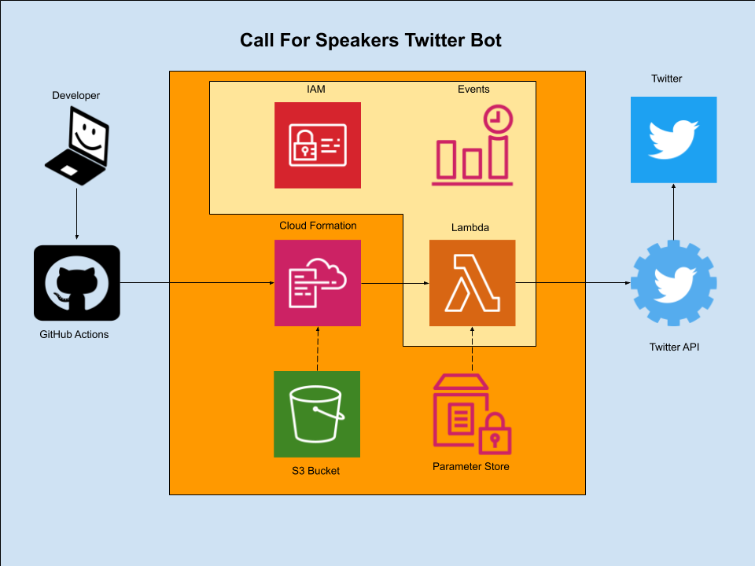

# CallForSpeakersTwitterBot
Call For Speakers Twitter Bot

## speakersBot.py
This Lambda Function is scheduled by Cloudwatch Rule and when run will **query** the Twitter API for tweets that contain either "call for speakers" OR "submit your talk" and filter out and **retweeted** tweets.  It will then check for technical keywords in the tweet like 'redhat', 'red hat', 'kubernetes', 'ansible', 'tech', 'hacker', 'opensource', 'data science', 'pipeline', 'sysops', 'devops', 'automation' to hopefully keep the tweets related to technical space.

